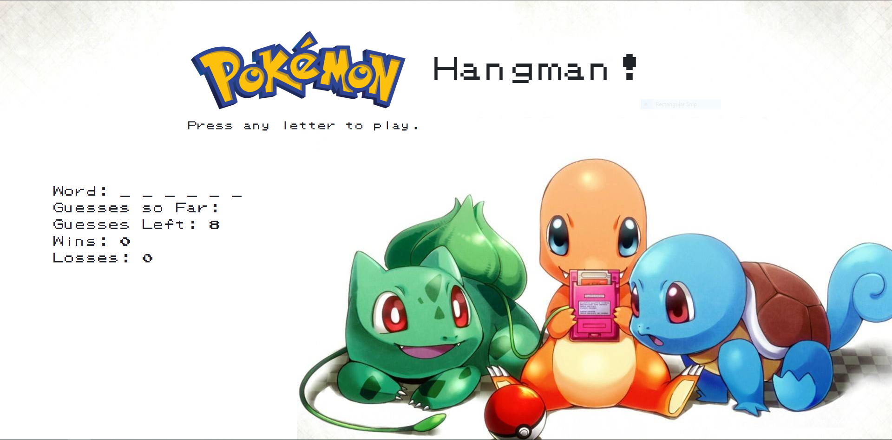

# Hangman!

Classic Hangman Game, but Pokemon themed.

## Getting Started

You can find the game at this link.
[Hangman](https://liangbryan2.github.io/Word-Guess-Game/)

### Prerequisites

This game was tested on Google Chrome but should work on any internet browser.

```
Google Chrome
Firefox
Microsoft Edge
etc.
```
### Images



### Code Snippets

``` js
function winner() {
    word = randomWord();
    underscore(word);
    document.getElementById("word").textContent = underscores.join(' ');
    win++;
    document.getElementById("wins").textContent = win;
    guessLeft = 8;
    document.getElementById("guess-left").textContent = guessLeft;
    userGuess = [];
    document.getElementById("guesses").textContent = userGuess;
}
```
``` html
<div class="header jumbotron jumbotron-fluid">
    <div class="container">
        <h1 class="display-4">
             Hangman!</h1>
        <p class="lead">Press any letter to play.</p>
    </div>
</div>
```

## Built With

* HTML
* Javascript
* CSS
* Bootstrap

## Learning Points

The goal of this project was to learn the basics of Javascript. From variable declartion to creating functions. The game is based on the onkeyup event in Javascript and I had to create different functions that would do specific things based on what key was pressed. Another big part of this project was learning how to modify the DOM in the Javascript functions. 

## Author

**Bryan Liang** - [My Github](https://github.com/liangbryan2)

## License

This project is licensed under the MIT License - see the [LICENSE.md](LICENSE.md) file for details

## Acknowledgments

* [Superpencil](https://github.com/Superpencil/pokemon-font) For the Pokemon font
